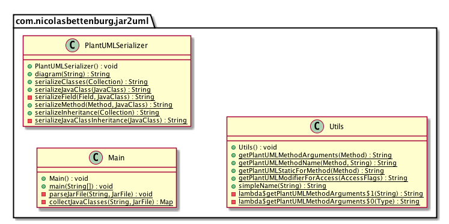

# Jar2UML
A re-documentation tool that describes the classes in a given JAR file as a UML (PlantUML) class diagram.

## Building
Uses `gradle`. For MacOSX, you can install `gradle` via homebrew: `brew install gradle`.

Building the tool is straightforward:

```
gradle distZip
```

You will find a distributable zip archive under `build/distributions`.

## Running

Once you have built the distributable zip, unpack it and run as follows:

```
bin/jar2uml <INPUT>
```

with `<INPUT>` being any jar file that you want to document. The tool will output to `stdout` the PlantUML code, so you might want to redirect `bin/jar2uml <INPUT> > mydiagram.plantuml`.

## Sample Output

The following output was generated from a run of `bin/jar2uml lib/jar2uml-0.0.1.jar`:



## ToDo List

At this point, the tool is usable for my own purposes, but is pretty rough - the success paths should work, any errors will fry the program. Over time, I plan to add the following:

- [ ] Proper CLI Arguments processing and CLI help output
- [ ] Ability to specify multiple input files
- [ ] Ability to point to a source code folder, rather than JAR files
- [ ] Diagramming to be configurable (size, direction)
- [ ] Styling of output diagram, possibly given a 'stylesheet' definition
- [ ] Configurable whether class relationships should be included (inheritance, implementation of Interfaces)
- [ ] Configurable which class members should be included (e.g., only show public members...)
- [ ] Ability to specify a class filter via regex for classes to include / exclude
